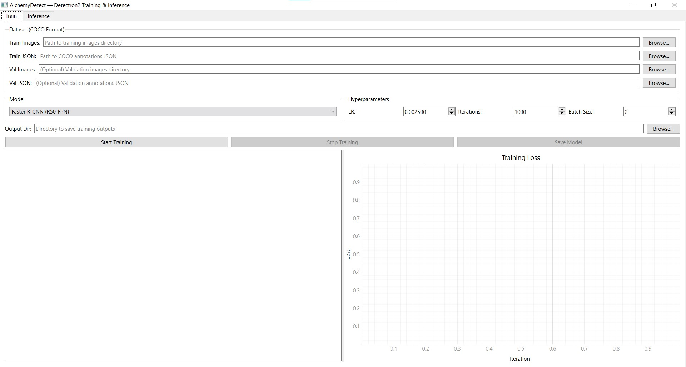

# AlchemyDetect

A desktop GUI application for training and running inference with Detectron2 models.



## Features

- **Train** object detection and instance segmentation models with a visual interface
- **Live monitoring** — real-time loss plot and training logs
- **Inference** on single images or entire folders with result visualization
- **Model management** — save and load trained weights for later use
- **Export** trained models to ONNX or TensorRT for faster deployment
- **Deploy** — run exported ONNX/TensorRT models in-app, independent of Detectron2

## Supported Models

| Model | Task |
|-------|------|
| Faster R-CNN (R50-FPN, R101-FPN) | Object Detection |
| RetinaNet (R50-FPN, R101-FPN) | Object Detection |
| Mask R-CNN (R50-FPN, R101-FPN) | Instance Segmentation |

## Quick Start

```bash
# Install dependencies (see INSTALL.md for detailed setup)
pip install -r requirements.txt

# Run the application
python main.py
```

## Dataset Format

AlchemyDetect uses **COCO JSON** format for training datasets. You need:
- A directory containing your training images
- A COCO-format JSON annotation file

## Usage

### Training
1. Open the **Train** tab
2. Select your training images directory and COCO JSON annotation file
3. Choose a model architecture from the dropdown
4. Set hyperparameters (learning rate, iterations, batch size)
5. Choose an output directory
6. Click **Start Training**
7. Monitor progress via the log viewer and loss plot

### Inference
1. Open the **Inference** tab
2. Click **Load Model** and select a trained `.pth` file (config.yaml will be auto-detected if in the same directory)
3. Adjust the confidence threshold
4. Click **Run on Image** or **Run on Folder**
5. Browse results using the navigation buttons

### Export (ONNX)
1. Install the export extra: `pip install alchemydetect[export]`
2. Open the **Export** tab
3. Click **Load Model...** and select a trained `.pth` file (config.yaml is auto-detected)
4. Choose **ONNX**, set the opset / input size / fp16 / dynamic-axes options
5. Pick an output directory and click **Export**
6. The output directory will contain `model.onnx`, the copied `config.yaml` /
   `class_names.json`, and an `export_metadata.json` describing the model

> Detection models (Faster R-CNN, RetinaNet) export reliably. Mask R-CNN
> (instance segmentation) export is **experimental**.
>
> ONNX export requires the `onnx` package — if you skip the `[export]` extra the
> Export tab will tell you to install it. **TensorRT** export appears as a format
> option only when the `tensorrt` package is installed (build the ONNX first,
> then a `model.engine`); install TensorRT manually to match your CUDA/cuDNN.

### Deploy (run exported models)
1. Open the **Deploy** tab
2. Click **Load Model...** and select an exported `model.onnx` or `model.engine`
   (its `export_metadata.json` must sit alongside it — produced by the Export tab)
3. Adjust the confidence threshold
4. Click **Run on Image** or **Run on Folder** and browse results

ONNX runs via `onnxruntime` (GPU provider used automatically when available);
`.engine` files run via a TensorRT runtime (requires `tensorrt` + `pycuda`).
Both are independent of Detectron2's predictor. The side panel shows the active
runtime provider and the per-image detection time so you can confirm whether
inference is on CPU or GPU.

> If exported ONNX/TensorRT inference seems slow, check the provider label — if
> it says `CPUExecutionProvider`, onnxruntime fell back to CPU (it needs a CUDA
> runtime matching your `onnxruntime-gpu` build). The real speedups come from GPU
> + TensorRT.

For how the TensorRT path works and exact install steps (Linux/Windows/Docker),
see [docs/TensorRT.md](docs/TensorRT.md).

## Logs

The app writes a timestamped session log to a `logs/` directory (set
`ALCHEMYDETECT_LOG_DIR` to change the location). Training/export output and
inference errors — including worker tracebacks — are mirrored there so you can
analyze issues after the fact. The active log path is shown in the status bar.

## Tech Stack

- **Python 3.10 or 3.11**
- **PyQt6** — Desktop GUI
- **Detectron2** — Object detection / instance segmentation
- **PyTorch** — Deep learning backend
- **pyqtgraph** — Real-time loss plotting

## License

[MIT](LICENSE)
